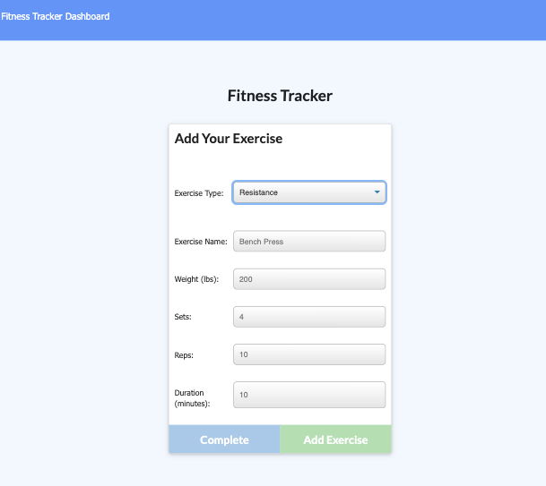
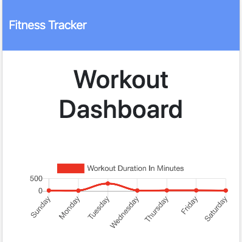
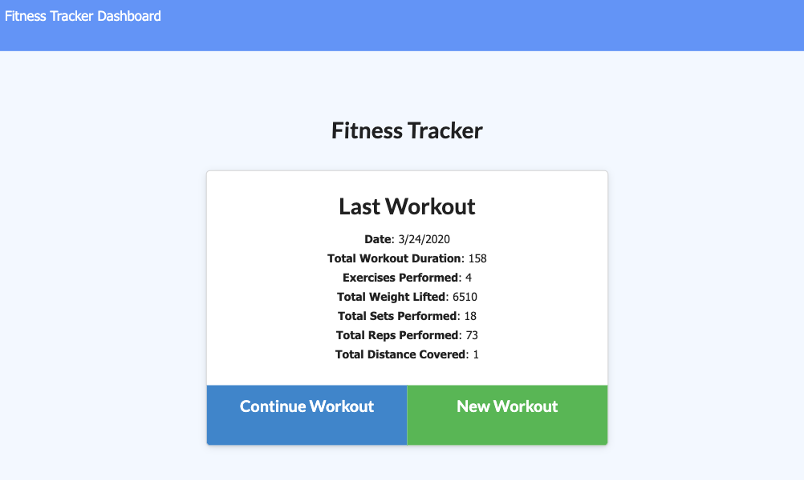

# WorkoutTracker

This is an app that I was the Backend Developer for. Technologies used include Express, Node, MongoDB, Mongoose, and Heroku. 

This app allows users to view, track, and create workouts in colorful chart/graph form. 

Deployed Link: https://glacial-fjord-33951.herokuapp.com/

**Screenshots**:

